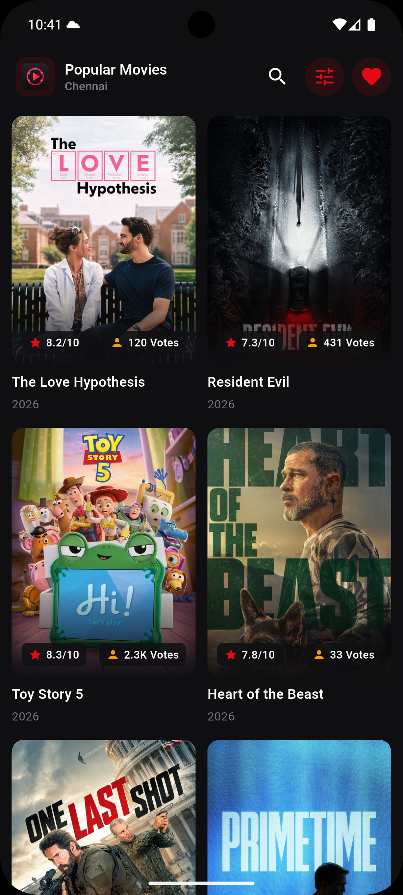

# moviebrowserapp

A Flutter-based Movie Browser application built using the TMDB (The Movie Database) API.

The application allows users to browse movies, view movie details, search/filter movies, and explore movie information through a clean and responsive interface.

Developer

Name: Gokul G

Role: Flutter Developer

Project Overview

The Movie Browser App is developed as a Flutter evaluation project with a focus on:

Clean and maintainable code
Separation of concerns
Reusable widgets
State management
REST API integration
Responsive UI
Error and loading-state handling
Movie search and filtering
Movie details
TMDB image integration

The application consumes movie data from the TMDB API.

Features

Movie Browsing
Search
Filtering
Movie Details
UI/UX
Supports both portrait and landscape orientations.

Architecture :: The project follows a layered architecture with separation between presentation, business logic, data handling, and core application functionality.

State Management :: GetX for state management

GetX is used for: 
Reactive UI updates
Controller-based business logic
Dependency injection
Loading state management
Error state management
Search/filter state
Managing selected movie information

Why GetX?
Simple reactive state management
Less boilerplate
Easy controller lifecycle management
Dependency injection
Convenient navigation support

TMDB API
The application uses the TMDB API to retrieve movie information.

TMDB provides movie-related information.

Getting a TMDB API Key
Step 1 — Create a TMDB account
Step 2 — Open API settings
    Open your account settings.
    Navigate to the API section.
    Request/create an API key.
    Follow the TMDB API registration process.
    Copy your API key.

API_KEY = a5ddcca78757b04e524f39bb99af2fc0

External Packages :: 

get =>	State management, dependency injection and navigation
dio =>	HTTP requests and TMDB API communication
flutter_dotenv =>	Loading environment variables/API configuration
cached_network_image =>	Efficient network image loading and caching

Requirements ::
Flutter SDK is required.
Version ::
    Flutter 3.44.2
    Dart 3.12.2

Installation & Setup ::
    git clone https://github.com/Gokul007-G/Movie-Browser-App.git
    flutter pub get
    flutter run

  
  
  
  
  
  
  
  
  
  
  
  
  
  

